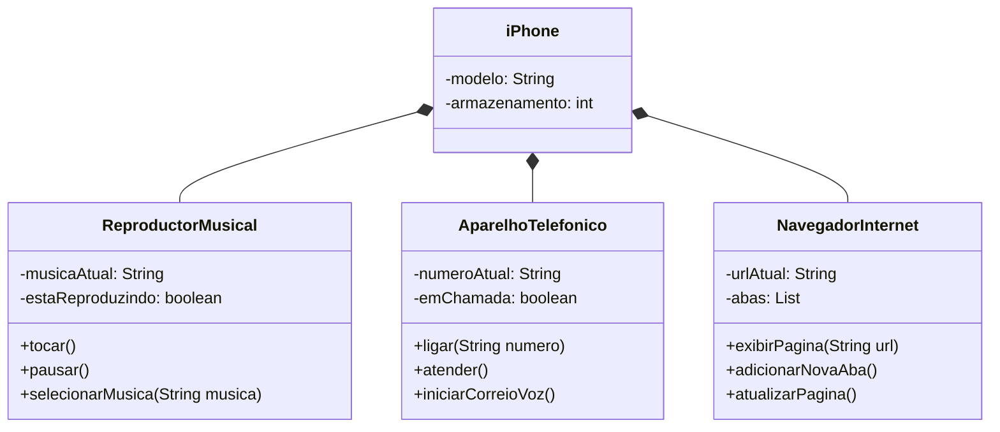

# Modelando o Iphone com UML - Desafio de Projeto [DIO](www.dio.me)

## POO - Desafio
## Resolução
Criei um diagrama no mermaid onde adicionei todas as funções, um diagrama facil de ler e entender cada parte.

## Autor
- [Luiz Almeida](https://github.com/LuizAlmeidaF)

## Diagrama UML (Mermaid)

